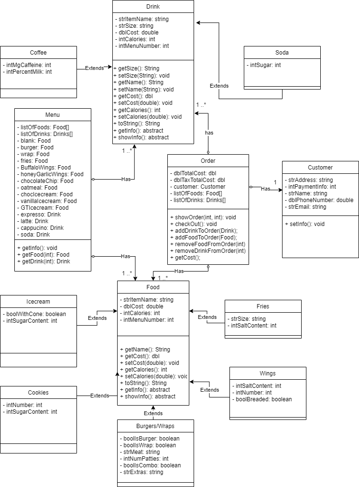

# ICS4U OOP Assignment

[*see instructions for details*](Instructions.md)

*Insert Class Diagram here*  

## Summary
*Include a brief summary that describes your system that your are modelling*

This is a model of a Restaurant's (bigDonalds) online ordering system. Within this system there is a Menu Class, which contains all Foods and Drinks Objects. Foods and Drinks are abstract classes, that contain Burgers, Fries, Wings, Desserts, Coffes, and Sodas. Finally, an order class is where the customer and their chosen food and drink objects are stored. In the main class, the user is first displayed the menu of the restaurant and is able to order items by typing in the item number. They are then presented with options to customize each food. After customizing each item, the user is then able to checkout, continue ordering, or decide to remove an item from their order. Once the customer is ready to checkout, they are then able to enter their personal info and the program ends. 
